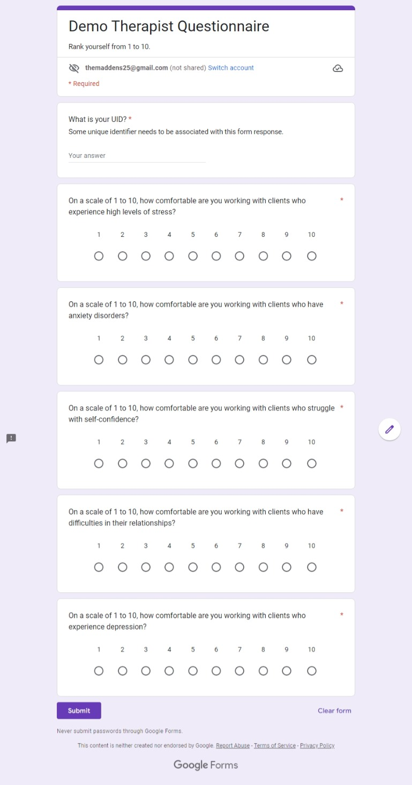
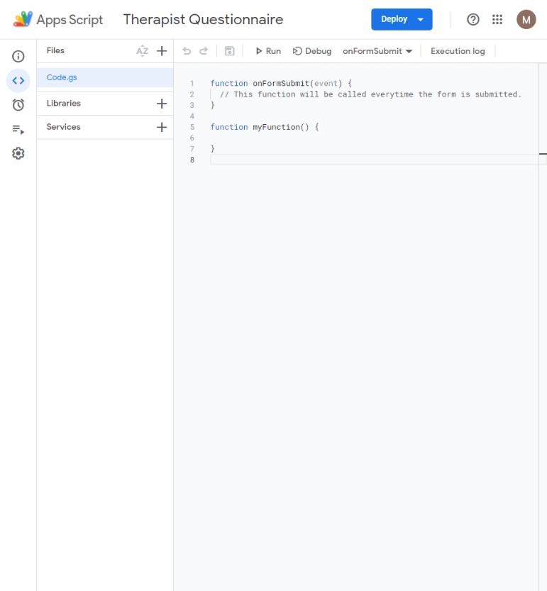
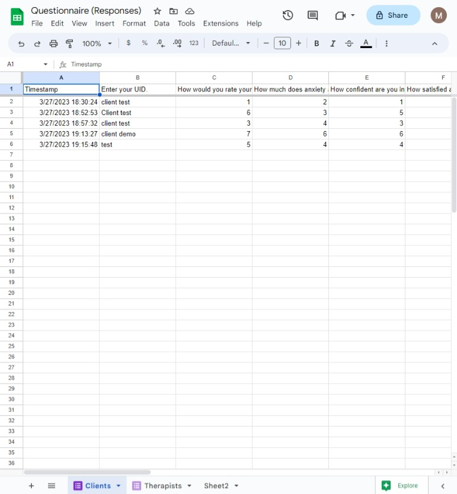



<style>
.row {
  display: flex;
}
.column {
  flex: 33.33%;
  padding: 2em;
}
.centered {
  text-align: center;
}
</style>

<h2> Questionnaire Flow</h2>

<div class="row">
  <div class="column">
  <a href="https://docs.google.com/forms/d/e/1FAIpQLSfwhgFOYaW9p6bna0GfLjJyB5hT3oaPqq88mReXTcmcwZ_xRQ/viewform"></a>
  </div>
  <div class="column">
    <a href="https://docs.google.com/forms/d/e/1FAIpQLSfdcfGF7PkEegHfd15YFOB-d-wc3NS0qSjtJ1qADvlDKns_wQ/viewform"></a>
  </div>
</div>

<div class="row">
  <div class="column centered">
  ⬇️
  </div>
  <div class="column centered">
    ⬇️
  </div>
</div>

<div class="row">
  <div class="column">
  <a href="https://script.google.com/home/projects/1Zee293DSwmQTzhWdQb6cBUmsttWwCb5MwwQ0ZcPX6JzmLW4dE3nPJ1DQ/edit"></a>
  </div>
  <div class="column">
    <a href="https://script.google.com/home/projects/1IdNZ7iL_2sL9VSDZSLYnzh_i6mjywzQjamofpUwi62NNmZHQazMkVDCs/edit"></a>
  </div>
</div>

<div class="row">
  <div class="column centered">
  ⬇️
  </div>
  <div class="column centered">
    ⬇️
  </div>
</div>

<div class="row">
  <div class="column centered">
  <a href="https://docs.google.com/spreadsheets/d/1ACpGIUQ_EA42Ym_yDxNpb81DWHLXSTX1jHzq7cnNxdI/edit?resourcekey#gid=1443418222"></a>
  </div>
</div>



<h2>Google Sheets API Stuff</h2>
<h3>Configure the OAuth consent screen and add test users</h3>
https://console.cloud.google.com/apis/credentials/consent

<h3>Create an OAuth client ID</h3>
https://console.cloud.google.com/apis/credentials

<h2>Creating the Anaconda Environment</h2>

```Python
conda create --name questionnaire python=3.8
conda activate questionnaire
pip install --upgrade google-api-python-client google-auth-httplib2 google-auth-oauthlib gradio pandas
```

<h2>Using the Program</h2>

```Shell
cd C:\Users\50567920\Documents\GitHub\Questionnaire
python3 run.py
```